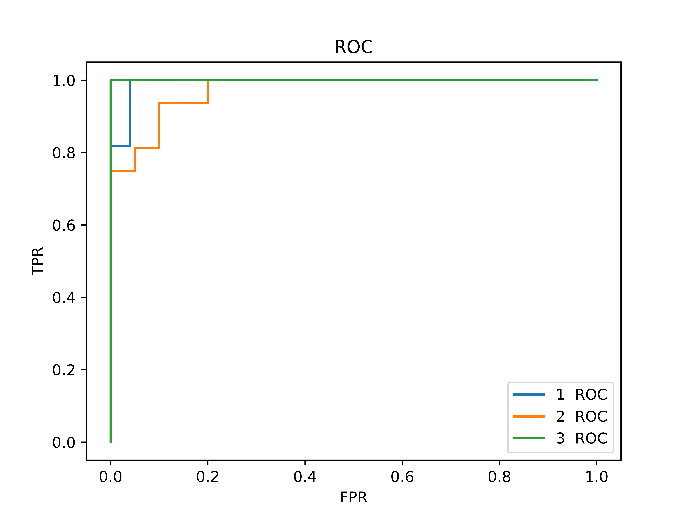

# 实验四：朴素贝叶斯实验报告
## 实验描述

1. 本次实验主要学习掌握朴素贝叶斯分类器的原理与实现
2. 掌握混淆矩阵的计算方法以及可以通过混淆矩阵得出的结论
3. 了解ROC曲线的绘制方法，以及AUC值的计算

## 实验原理

### 贝叶斯定理

本次实验我们需要设计出一个朴素贝叶斯分类器，而其理论基础正是源于概率论中的贝叶斯定理。简单来说，贝叶斯定理是关于随机事件 A 和 B 的条件概率 的一则定理，其常见的表示公式如下： 
$$
P(A|B) =\frac{P(A) × P(B|A)}{P(B)}
$$
公式中各项在贝叶斯定理中的含义为： 

- P(A|B) 是已知 B 发生后 A 的条件概率，也由于得自 B 的取值而被称作 A 的 后验概率。 
- P(A) 是 A 的先验概率（或边缘概率）。之所以称为” 先验” 是因为它不考虑任 何 B 方面的因素。
- P(B|A) 是已知 A 发生后 B 的条件概率，也由于得自 A 的取值而被称作 B 的 后验概率。
- P(B) 是 B 的先验概率或边缘概率。 

按照以上定义，贝叶斯定理即可被理解为后验概率与先验概率和相似度的乘积成正比。

* 优点
朴素贝叶斯算法假设了数据集属性之间是相互独立的，因此算法的逻辑性十分简单，并且算法较为稳定，当数据呈现不同的特点时，朴素贝叶斯的分类性能不会有太大的差异。换句话说就是朴素贝叶斯算法的健壮性比较好，对于不同类型的数据集不会呈现出太大的差异性。当数据集属性之间的关系相对比较独立时，朴素贝叶斯分类算法会有较好的效果。
* 缺点
属性独立性的条件同时也是朴素贝叶斯分类器的不足之处。数据集属性的独立性在很多情况下是很难满足的，因为数据集的属性之间往往都存在着相互关联，如果在分类过程中出现这种问题，会导致分类的效果大大降低。


### ROC曲线

在计算以上的度量指标后，实验的提高要求是 ROC 曲线的绘制。简单来说， ROC 分析的是二元分类模型，也就是输出结果只有两种类别的模型。

ROC 空间将伪阳性率（FPR）定义为 X 轴，真阳性率（TPR）定义为 Y 轴： 

- TPR：在所有实际为阳性的样本中，被正确地判断为阳性之比率。T P R = T P/(T P + F N) 
- FPR：在所有实际为阴性的样本中，被错误地判断为阳性之比率。F P R = F P/(F P + T N) 

在本次实验中，我们可以以第 n 类作为二分类基准，将阈值设置为测试样本 在第 n 类上的概率值，即可绘制出 ROC 曲线。 最后，将模型的 ROC 曲线画出来后，我们可以计算曲线下面积做为模型优劣 的指标，即 AUC（Area under the Curve of ROC）值。

## 实验数据分析

此数据集是对意大利同一地 区生产的三种不同品种的酒做大量分析所得出的数据，数据的存储形式如图 1 所 示，文件中包含 178 行、14 列的数字，列与列之间以逗号分割。其中第 1 列为标 签，其余 13 列为特征，各维特征均为连续值，其实际意义如下所示： 1. Alcohol 2. Malic acid 3. Ash 4. Alcalinity of ash 5. Magnesium 6. Total phenols 7. Flavanoids 8. Nonflavanoid phenols 9. Proanthocyanins 10. Color intensity 11. Hue 12. OD280/OD315 of diluted wines 1 13. Proline 

178 行数据中根据标签的不同分为 3 组，每组分别为 59 行、71 行和 48 行。此次实验需要我们基于后 13 列的特征构造朴素贝叶斯分类器，然后根据测试数据的 特征计算出预测的标签，与第 1 列的实际标签进行比较，计算出混淆矩阵、精确 率、召回率和 F1 值，绘制出 ROC 曲线，并基于此计算 AUC 值。

## 实验步骤

### 代码架构
目录结构如下
```
├── autograd (自己编写的包)
│   ├── dataset.py (实现常用的数据读取，划分数据，包括分层等)
│   ├── ml.py (基础的机器学习类)
│   └── utils.py (内包含计算高斯分布的函数)
└── hm04_NB (第四次作业代码)
    ├── main.py (主函数，NB类，辅助实现类，画图)
    └── wine.data (数据)
```

### 数据读取器
考虑三种接口，给予csv格式，excel格式和直接给划分好的numpy数组格式，分别考虑
```python
class DataLoader:
    train: np.ndarray
    label: np.ndarray

    def __init__(self, train: Union[np.ndarray, list, None], label: Union[np.ndarray, list, None], path: str = None,
                 mod: str = 'set'):
        if train is None and label is None and path is not None:
            # 使用文件的形式读取
            if mod in ['csv', 'excel', 'csv_first', 'excel_first']:
                # 暂只支持csv和excel
                if 'csv' in mod and 'csv' in path:
                    _file = pd.read_csv(path)
                elif 'excel' in mod:
                    _file = pd.read_excel(path)
                else:
                    assert 0
                # 标签位于数据的首部或尾部
                if 'first' in mod:
                    _x = _file.iloc[:, 1:]
                    _y = _file.iloc[:, 0]
                else:
                    _x = _file.iloc[:, :-1]
                    _y = _file.iloc[:, -1]
                train = np.array(_x, dtype=np.float)
                label = np.array(_y, dtype=np.float)
        train = np.array(train)
        label = np.array(label)
        min_data = train.min(0)
        max_data = train.max(0)
        self.train = (train - min_data) / (max_data - min_data)  # 数据归一化
        self.label = label

    def split(self, alpha: float = 0.90) -> Tuple[np.ndarray, np.ndarray, np.ndarray, np.ndarray]:
        """
        按照测试集占总体alpha的比例划分数据集
        :param alpha:
        :return: x_train, x_test, y_train，y_test
        """
        assert 0 <= alpha <= 1
        # 数据集打乱
        state = np.random.get_state()
        np.random.shuffle(self.train)
        np.random.set_state(state)
        np.random.shuffle(self.label)
        _len = int(alpha * len(self.train))
        return self.train[:_len], self.train[_len:], self.label[:_len], self.label[_len:]

    def hierarchy(self, nums: int = 5) -> Tuple[np.ndarray, np.ndarray, np.ndarray, np.ndarray]:
        '''
        按照每nums次抽一条的方式分层抽样
        :param nums:
        :return: x_train, x_test, y_train，y_test
        '''
        # 数据集打乱
        state = np.random.get_state()
        np.random.shuffle(self.train)
        np.random.set_state(state)
        np.random.shuffle(self.label)
        train_data = [x for i, x in enumerate(self.train) if i % nums != 0]
        test_data = [x for i, x in enumerate(self.train) if i % nums == 0]
        train_label = [x for i, x in enumerate(self.label) if i % nums != 0]
        test_label = [x for i, x in enumerate(self.label) if i % nums == 0]
        return np.array(train_data), np.array(test_data), np.array(train_label), np.array(test_label)

```

### 计算高斯分布

借助`numpy`包中的线性代数库`numpy.linalg`，给出多元高斯分布的结果

```python
def normal(x: Union[Tensor, float], mean: Union[Tensor, float], var: Union[Tensor, float], inv: np.matrix = None,
           det: Union[np.matrix, float] = None) -> float:
    # TODO: 格式检查
    x = np.mat(x)
    n = x.shape[-1]
    mean = np.mat(mean)
    var = np.mat(var)
    if inv is None:
        inv = np.linalg.inv(var)
    if det is None:
        det = np.linalg.det(var)
    return 1 / (np.float_power(2 * np.pi, n / 2) * (det ** 0.5)) * (
        np.exp(-0.5 * (x.T - mean).T @ inv @ (x.T - mean)))[0, 0]
```

### 基础机器学习类

为了方便之后的扩展，基础机器学习类实现了计算混淆矩阵和准确率，需要子类实现预测和拟合（模仿`sklearn`的格式）

```python
class BaseML(abc.ABC):
    @abc.abstractmethod
    def fit(self, *args):
        pass

    @abc.abstractmethod
    def predict(self, X: np.ndarray) -> np.ndarray:
        pass

    def cal_acc(self, label: np.ndarray, Y: Optional[np.ndarray] = None, X: Optional[np.ndarray] = None) -> float:
        '''
        计算准确率
        :param label: 标签
        :param Y: 预测值
        :param X: 数据
        :return: 准确率
        '''
        if Y is None:
            if X is None:
                assert 0
            Y, _ = self.predict(X)
        acc = [i == j for i, j in zip(Y, label)]  # 判断是否和标签一致
        return sum(acc) / len(acc)

    def cal_mix(self, label: np.ndarray, is_pos, Y: Optional[np.ndarray] = None, X: Optional[np.ndarray] = None):
        '''
        :param label: 标签
        :param is_pos: 判断一个标签是否是正例的函数（用来将多分类变成二分类）
        :param Y: 预测的标签
        :param X: 需要预测的数据
        :return: tp,fp,fn,tn 对于每一个数据的混淆矩阵
        '''
        if Y is None:
            if X is None:
                assert 0
            Y, _ = self.predict(X)
        tp = []
        fp = []
        fn = []
        tn = []
        for y, r in zip(Y, label):
            if is_pos(r):
                if y == r:
                    tp.append(1)
                    fp.append(0)
                    fn.append(0)
                    tn.append(0)
                else:
                    tp.append(0)
                    fp.append(0)
                    fn.append(1)
                    tn.append(0)
            else:
                if is_pos(y):
                    tp.append(0)
                    fp.append(1)
                    fn.append(0)
                    tn.append(0)
                else:
                    tp.append(0)
                    fp.append(0)
                    fn.append(0)
                    tn.append(1)

        return tp, fp, fn, tn
```

### Naive Bayes
对每一类数据使用高斯分布进行拟合，统计出现的频率并计算先验概率。

辅助的高斯类
```python
class Normal:
    def __init__(self, data=None, mean=None, var=None):
        if mean is None and var is None:
            n = len(data[0])
            mean = np.zeros([n, 1])
            var = np.zeros([n, n])
            for _i in range(n):
                # 假设变量都是独立的，所以协方差矩阵为对角阵
                mean[_i, 0] = np.mean(data[:, _i])
                var[_i, _i] = np.var(data[:, _i])
        self.mean = mean
        self.var = var
        self.mean_mat = np.mat(mean)
        self.var_mat = np.mat(var)
        # 预处理计算协方差矩阵的特征值与逆
        self.inv_mat = np.linalg.inv(self.var_mat)
        self.var_det = np.linalg.det(self.var_mat)

    def prob(self, x):
        # 调用计算高斯分布的函数获得概率值
        return normal(x, self.mean, self.var, self.inv_mat, self.var_det)
```
Naive Bayes类
```python
class NaiveBayes(BaseML):
    items: list
    prior: list

    def __init__(self):
        self.items = []
        self.prior = []

    def fit(self, train_data: np.ndarray, train_label: np.ndarray, classes: int = 3,
            disstribution: str = 'normal'):
        self.items = []
        if disstribution == 'normal':
            Dis = Normal
        else:
            Dis = Normal
        train_data_label = [np.array([train_data[j] for j, x in enumerate(train_label) if x == i]) for i in
                            range(1, classes + 1)] # 将数据根据标签划分为三类
        self.items = [Dis(one) for one in train_data_label] # 对这三类分别构建高斯分布的模型
        self.prior = [1 / len(one) for one in train_data_label] # 分别计算三类的先验概率

    def predict(self, X: np.ndarray) -> Tuple[Union[np.ndarray, list], Union[np.ndarray, list]]:
        # 对于每一个数据计算三类的概率，乘以先验后取给出最大值的类作为标签
        labels = [np.argmax([p.prob(x) * self.prior[i] for i, p in enumerate(self.items)]) + 1 for x in X]
        # 计算它属于每一个类的概率，为后续画图做准备
        prob = [[p.prob(x) * self.prior[i] for x in X] for i, p in enumerate(self.items)]
        return labels, prob
```

### 模型评估

计算混淆矩阵，精确率，召回率，F值

```python
np.random.seed(7)
train_data, label = read_data('wine.data')
data_loader = DataLoader(train_data, label)
train_data, test_data, train_label, test_label = data_loader.hierarchy()
NB = NaiveBayes()
NB.fit(train_data=train_data, train_label=train_label)
ans, _ = NB.predict(test_data)
acc = NB.cal_acc(test_label, ans)
print(acc)
for i in range(1, 4):
    tp, fp, fn, tn = NB.cal_mix(test_label, get_pos(i), ans)
    tp_num = sum(tp)
    fp_num = sum(fp)
    fn_num = sum(fn)
    tn_num = sum(tn)
    print([[tp_num, fp_num], [fn_num, tn_num]]) # 对于每一类的混淆矩阵
    accuracy = (tp_num + tn_num) / (tp_num + tn_num + fp_num + fn_num) 
    precision = tp_num / (tp_num + fp_num) 
    recall = tp_num / (tp_num + fn_num) 
    F1 = 2 * precision * recall / (precision + recall)
    print(i, accuracy, precision, recall, F1)
```
实验结果
```python
0.9722222222222222
[[11, 0], [0, 25]]
1 1.0 1.0 1.0 1.0
[[15, 0], [1, 20]]
2 0.9722222222222222 1.0 0.9375 0.967741935483871
[[9, 1], [0, 26]]
3 0.9722222222222222 0.9 1.0 0.9473684210526316
```
### ROC、AUC

对于 ROC 曲线的绘制，我们针对于每类进行，通过分别调整阈值至测试样本在第 `i` 类上的概率值，计算出阳性率（FPR）和真阳性率（TPR），再调用 `matplotlib` 中的方法进行曲线绘制，最后根据 AUC 值计算公式计算出 AUC 值即可：

```python
def draw(prob: np.ndarray, test_label):
    prob = np.array(prob)
    test_label = np.array(test_label)
    fpr, tpr = [[0], [0], [0]], [[0], [0], [0]]# 左下角都是0，0
    auc = [0] * 3
    plt.figure()
    for i in range(3):
        # 计算fpr和tpr，阈值从大到小
        for j in np.argsort(prob[i])[-2:0:-1]:
            threshold = prob[i][j]
            # 根据阈值分类
            tp = [1 if l == i + 1 and p >= threshold else 0 for l, p in zip(test_label, prob[i])]
            fp = [1 if l != i + 1 and p >= threshold else 0 for l, p in zip(test_label, prob[i])]
            fn = [1 if l == i + 1 and p < threshold else 0 for l, p in zip(test_label, prob[i])]
            tn = [1 if l != i + 1 and p < threshold else 0 for l, p in zip(test_label, prob[i])]
            fpr[i].append(sum(fp) / (sum(fp) + sum(tn)))
            tpr[i].append(sum(tp) / (sum(tp) + sum(fn)))
        fpr[i].append(1) # 右上角都是1，1
        tpr[i].append(1)
        auc[i] = np.trapz(tpr[i], fpr[i]) # 计算面积
        # 绘图
        plt.title('ROC')
        plt.plot(fpr[i], tpr[i], label=str(i + 1) + "  ROC")
        plt.xlabel('FPR')
        plt.ylabel('TPR')
        print(str(i + 1) + 'AUC:', auc[i])
    plt.legend()
    plt.savefig('roc.png')
    plt.show()
```


```
1  AUC: 0.9927272727272728
2  AUC: 0.9718749999999999
3  AUC: 1.0
```